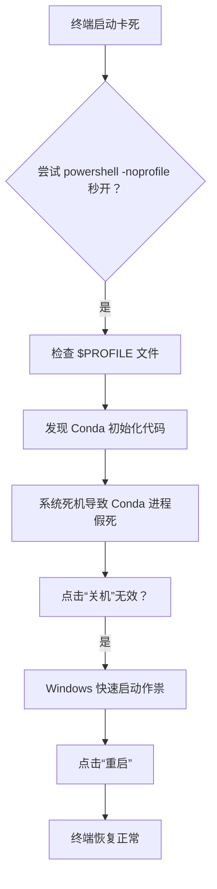

# Conda假死导致的Windows 终端启动卡死

你是不是也遇到过这样的场景：电脑因为内存爆满突然死机，系统自动关闭了一些应用程序后终于恢复“正常”。但当你习惯性地打开Windows终端（PowerShell或CMD）时，却发现它卡在启动画面，一直加载，永远加载不出来。别急，这大概率不是系统坏了，而是Conda在搞鬼。

## 问题排查：从现象到根源

首先，我们得确定问题出在哪里。一个非常有效的诊断方法是使用`-noprofile`参数启动PowerShell：

```powershell
powershell -noprofile
```

如果这个命令几乎是秒开，那说明问题出在终端的启动配置文件（Profile）上。在终端中输入以下命令，查看配置文件的具体路径：

```powershell
$PROFILE
```

打开这个文件，你大概率会看到类似下面的代码块：

```powershell
#region conda initialize
# !! Contents within this block are managed by 'conda init' !!
If (Test-Path "D:\anaconda3\Scripts\conda.exe") {
    (& "D:\anaconda3\Scripts\conda.exe" "shell.powershell" "hook") | Out-String | ?{$_} | Invoke-Expression
}
#endregion
```

**罪魁祸首找到了：Conda！**

## 为什么Conda会导致终端卡死？

当系统因内存爆满而死机时，Conda的一些后台进程（例如用于初始化环境的`conda.exe`）并没有被正确释放或终止。这些进程可能处于一种“假死”或“挂起”状态，占用了某些系统资源或句柄。

当终端再次启动并执行`$PROFILE`文件中的Conda初始化命令时，它会尝试与这些已经“坏掉”的进程进行通信。由于进程无法响应，终端就会陷入无限等待，表现为启动卡死。

## 为什么关机没用？重启才是正解

很多人在遇到这个问题时，第一反应是点击“关机”，然后重新开机。但你会发现，问题依旧。这是因为Windows默认启用了**快速启动**功能。

快速启动的工作原理类似于休眠：它会在关机时将系统内核和驱动程序保存到硬盘的一个文件中，下次开机时直接加载这个文件，从而大幅缩短启动时间。但这也意味着，**点击“关机”并不会完全清空内存和释放所有进程句柄**。那些“假死”的Conda进程和它们占用的资源，仍然被保留在休眠文件中。

> [!important]
> 正确的做法是：**点击“重启”**。重启操作会忽略快速启动，强制系统进行完整的关机、清空内存、重置所有驱动和进程状态，然后再重新引导。这才是真正意义上的“从头开始”。

所以，当你遇到终端启动卡死时，请记住这个简单的流程：



## 总结

| 操作 | 效果 | 原因 |
|------|------|------|
| 关机 |  无效 | 快速启动保留了进程状态 |
| 重启 |  有效 | 完全清空内存，重置所有句柄 |

下次遇到这类问题，别再傻傻地关机了。记住，**重启 > 关机**。这个经验不仅适用于Conda导致的终端卡死，也适用于很多其他由进程残留引起的奇怪问题。