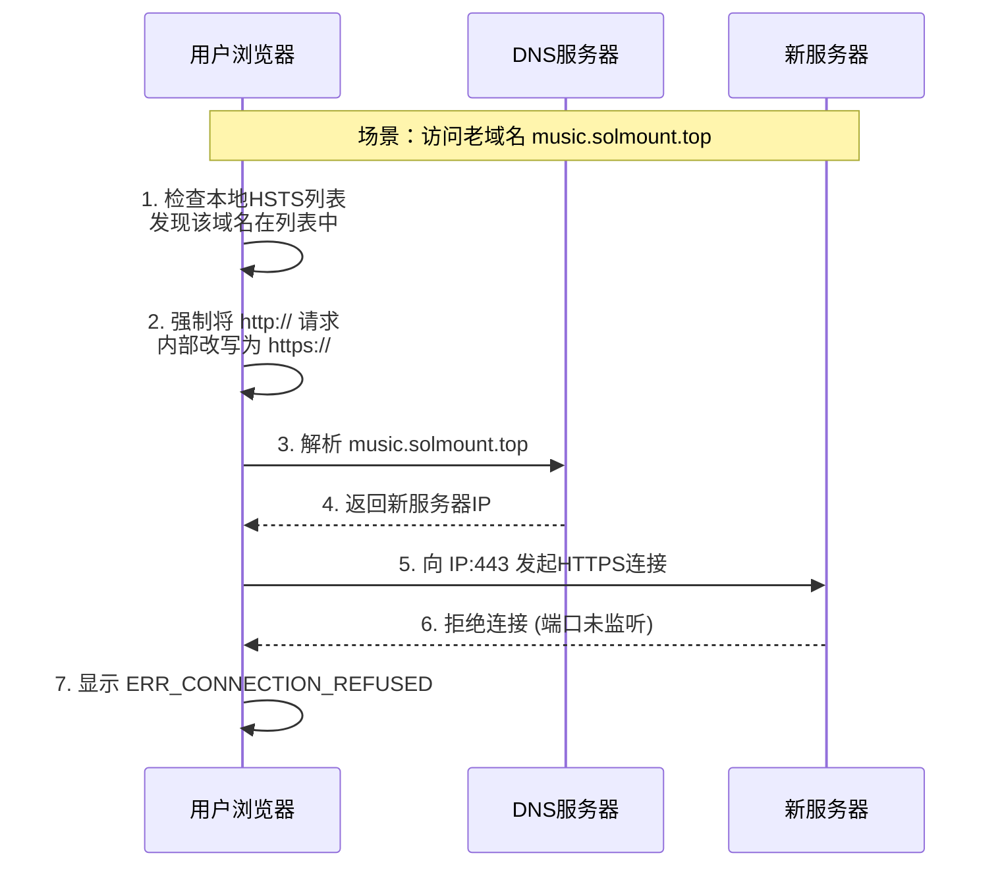

在运维工作中，服务器迁移是家常便饭。通常，我们修改DNS解析，等待全球生效，然后一切如常。然而，最近一次将 `music.solmount.top` 从旧服务器迁移到新服务器（IP：`***.***.**.**`）的经历，却让我遭遇了一系列“诡异”现象，最终将问题根源指向了浏览器深处的一个安全机制——HSTS。本文将详细复盘这次排查过程，并深入解析其背后的原理。

## 1. 现象：一个“薛定谔”的网站

迁移完成后，我满怀信心地在浏览器中输入了域名，迎接我的却是冰冷的错误页面。但更奇怪的是，不同的测试方法得出了截然相反的结论：

*   **Ping 测试正常**：`ping music.solmount.top` 显示域名已正确解析到新服务器的IP `***.***.**.**`。
*   **直接访问 IP 正常**：通过 `http://***.***.**.**:端口` 可以毫无障碍地加载出网站页面。
*   **新域名正常**：使用另一个从未在该服务器上配置过的新域名访问，一切顺利。
*   **老域名罢工**：唯独在浏览器地址栏输入 `music.solmount.top` 时，页面瞬间报错 **`ERR_CONNECTION_REFUSED`**（连接被拒绝）。

这形成了一个矛盾的“薛定谔”状态：网站既“活着”（IP可访问），又“死了”（域名无法访问）。更令人困惑的是，按照以往经验，如果服务器未配置HTTPS，浏览器访问 `https://` 网址时，通常会显示“您的连接不是私密连接”之类的警告，允许用户“继续前往（不安全）”。但这次，它直接**拒绝连接**，连警告的机会都不给。

:::warning[关键线索]
问题的分水岭在于：**只有曾经配置过HTTPS的老域名会出现此问题，而全新的域名则完全正常。** 这强烈暗示问题与浏览器对该域名的“历史记忆”有关。
:::

## 2. 深度排查：锁定元凶 HSTS

既然网络层（DNS解析、IP连通性）没有问题，那么问题很可能出在应用层协议上。我使用 `curl` 命令绕开浏览器，直接探测服务器的响应：

```bash
# 测试 HTTP 80 端口
curl -I http://music.solmount.top
# 预期返回：HTTP/1.1 200 OK 或 302 Found，说明Web服务在80端口运行正常。

# 测试 HTTPS 443 端口
curl -I https://music.solmount.top
# 实际返回：curl: (7) Failed to connect to music.solmount.top port 443 after xx ms: Connection refused
```

测试结果一目了然：**服务器的443端口（HTTPS）根本没有监听**。新服务器上只部署了HTTP服务。

那么，浏览器为什么会尝试连接443端口呢？答案就是 **HSTS (HTTP Strict Transport Security)**。

### 什么是 HSTS？

HSTS 是一种重要的Web安全策略。当网站通过HTTPS访问，并在响应头中发送 `Strict-Transport-Security` 字段（例如 `Strict-Transport-Security: max-age=31536000`）时，浏览器会将该域名记录到本地的HSTS列表中。

**一旦被记录，在 `max-age` 指定的有效期内（通常是一年），浏览器会强制执行以下规则：**
1.  所有对该域名的HTTP请求（`http://`），都会在**浏览器内部**自动、强制地转换为HTTPS请求（`https://`）。
2.  即使用户手动输入 `http://`，或者点击一个 `http://` 的链接，浏览器也会在发起请求前先进行转换。
3.  在Chrome/Edge等浏览器中，你甚至无法点击“继续前往不安全网站”的警告（如果证书错误），因为它根本不会给你选择的机会。

:::note[设计初衷]
HSTS 的设计初衷是为了彻底防御“SSL剥离”等中间人攻击，确保用户与指定网站之间的通信始终处于加密状态，是提升安全性的重要手段。
:::

### 本案中的冲突

用一张时序图来清晰展示问题发生的全过程：



**冲突点在于**：由于该老域名在旧服务器时代配置过HTTPS并启用了HSTS，你的浏览器已经“牢记”：“访问 `music.solmount.top` 必须且只能使用HTTPS”。迁移后，新服务器尚未配置SSL证书和HTTPS服务（443端口关闭）。当浏览器忠实地执行HSTS策略，尝试连接一个不存在的服务时，自然就遭到了“拒绝连接”。
### 但至今不理解为什么aws服务器上的网站无论怎么搞网站依旧无法正常访问，ping也是全红，没办法了，不折腾了
