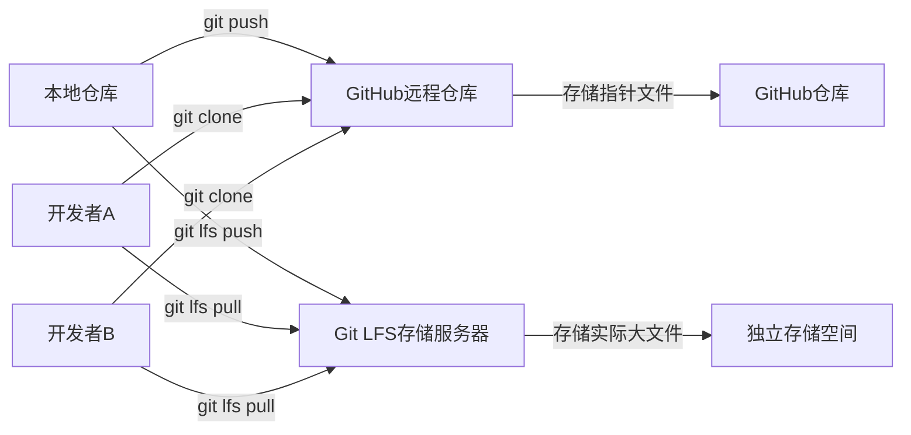

当你辛辛苦苦写完代码，准备上传到GitHub上时，突然在终端看到这样的报错信息：

```
remote: error: File xxx.zip is 152.00 MB; this exceeds GitHub's file size limit of 100.00 MB
remote: error: GH001: Large files detected. You may want to try Git Large File Storage - https://git-lfs.github.com.
```

是不是当场就懵了？别担心，这几乎是每个开发者都会遇到的“成长礼”。GitHub对文件上传确实有严格的限制——通过git命令行推送时，单个文件不能超过 **100MB**；通过网页端上传时，限制更严格，只有 **25MB**。一旦超过这个限制，GitHub就会拒绝你的推送请求。

> [!NOTE]
> 本文针对的是**已经开发完成、准备推送代码到远程仓库时**发现大文件问题的场景。如果你还在项目初期，建议从一开始就规划好大文件的管理策略。

## 为什么GitHub会有文件大小限制？

GitHub作为代码托管平台，其核心定位是管理**文本文件**和**源代码**。大文件（如训练好的机器学习模型、大型数据集、游戏资源包、视频文件等）会带来几个问题：

- **仓库体积膨胀**：每次修改大文件，git都会保存完整副本，导致仓库迅速变大
- **克隆速度变慢**：每个克隆仓库的人都需要下载所有历史版本的大文件
- **服务器压力**：存储和传输大文件消耗大量资源

为了解决这个问题，Git推出了 **Git Large File Storage (Git LFS)** 工具。它不是把大文件直接存入git仓库，而是用**指针文件**代替大文件，真正的文件内容存储在独立的LFS服务器上。

## Git LFS的工作原理

在深入操作之前，先简单理解一下Git LFS的工作机制：



当你使用Git LFS后，git仓库里保存的只是一个**指针文件**，内容类似于：

```
version https://git-lfs.github.com/spec/v1
oid sha256:4cac1a3f4b8b4f8b8b8b8b8b8b8b8b8b8b8b8b8b8b8b8b8b8b8b8b8b8b8b8b8b
size 152000000
```

这个指针文件只有几百字节，真正的152MB文件存储在LFS服务器上。当你`git clone`仓库时，得到的是轻量的指针文件；当你需要实际使用大文件时，再通过`git lfs pull`下载真正的文件内容。

## 操作步骤：使用Git LFS上传大文件

下面进入正题，按照流程一步步操作。

### 第一步：下载并安装Git LFS

访问Git LFS官方网站：[https://git-lfs.com](https://git-lfs.com)

根据你的操作系统选择对应的安装方式：

**Windows用户**：
- 下载安装程序直接运行
- 或使用包管理器：`choco install git-lfs`

**macOS用户**：
```bash
brew install git-lfs
```

**Linux用户**（Ubuntu/Debian）：
```bash
sudo apt install git-lfs
```

安装完成后，在终端验证是否成功：
```bash
git lfs --version
```
如果看到类似 `git-lfs/3.4.0 (GitHub; linux amd64)` 的输出，说明安装成功。

### 第二步：初始化Git LFS

打开你的**本地克隆仓库**，在终端中进入仓库目录，然后运行：

```bash
git lfs install
```

这个命令会在你的git全局配置中添加LFS相关的设置。只需要执行一次，之后所有仓库都可以使用LFS功能。

> [!TIP]
> `git lfs install` 是全局配置，如果你只想在当前仓库启用LFS，可以使用 `git lfs install --local`。

### 第三步：指定需要跟踪的大文件类型

这是最关键的一步。你需要告诉Git LFS哪些文件应该被它管理。使用以下命令：

```bash
git lfs track "*.zip"
```

这里的 `*.zip` 是一个**通配符模式**，表示所有以 `.zip` 结尾的文件都会被LFS接管。你可以根据需要替换成其他扩展名，比如：

- `"*.zip"` - 压缩包
- `"*.pkl"` - Python pickle模型文件
- `"*.h5"` - HDF5模型文件
- `"*.tar.gz"` - 压缩包
- `"*.mp4"` - 视频文件
- `"*.psd"` - Photoshop设计文件

你还可以同时跟踪多种类型：
```bash
git lfs track "*.zip" "*.pkl" "*.mp4"
```

执行这个命令后，git会自动创建一个 `.gitattributes` 文件（如果不存在的话），并添加相应的配置。你可以查看这个文件的内容：

```bash
cat .gitattributes
```

输出应该类似：
```
*.zip filter=lfs diff=lfs merge=lfs -text
*.pkl filter=lfs diff=lfs merge=lfs -text
```

> [!CAUTION]
> **非常重要**：`.gitattributes` 文件本身需要被git跟踪并推送到远程仓库。这样其他协作者克隆仓库时，会自动知道哪些文件应该用LFS管理。

### 第四步：将文件添加到暂存区

现在，你可以像平常一样将文件添加到git暂存区：

```bash
git add .
```

或者指定具体的文件：
```bash
git add your_large_file.zip
git add .gitattributes
```

### 第五步：提交并推送到GitHub

提交你的更改：

```bash
git commit -m "添加大文件，使用Git LFS管理"
```

然后推送到远程仓库：

```bash
git push origin main
```

如果一切顺利，你应该能看到类似这样的输出：
```
Uploading LFS objects: 100% (1/1), 152 MB | 5.2 MB/s, done.
Enumerating objects: 5, done.
...
To https://github.com/yourusername/yourrepo.git
   abc1234..def5678  main -> main
```

## 常见错误及解决方法

### 错误1：先add了大文件，后配置LFS

这是最容易踩的坑。如果你像作者一样，**先把大文件add到暂存区，发现上传不了，最后才去配置LFS**，那么git仍然会把这个大文件当作普通文件来上传，导致推送失败。

**原因**：git在 `git add` 时已经决定如何存储这个文件。即使你后续配置了LFS，已经add过的文件不会自动切换到LFS管理。

**解决方法**：

1. 取消暂存大文件：
   ```bash
   git reset HEAD your_large_file.zip
   ```

2. 配置LFS（如果还没配置）：
   ```bash
   git lfs track "*.zip"
   ```

3. 重新添加文件：
   ```bash
   git add your_large_file.zip
   ```

4. 提交并推送：
   ```bash
   git commit -m "使用LFS管理大文件"
   git push origin main
   ```

### 错误2：已经push了包含大文件的commit

如果你已经不小心提交了大文件（即使推送失败），这些大文件仍然存在于你的git历史中。你需要清理历史记录：

**方法一：使用BFG Repo-Cleaner（推荐）**

```bash
# 下载BFG工具
java -jar bfg.jar --delete-files your_large_file.zip

# 清理并强制推送
git reflog expire --expire=now --all && git gc --prune=now --aggressive
git push origin main --force
```

**方法二：使用git filter-branch**

```bash
git filter-branch --force --index-filter \
  "git rm --cached --ignore-unmatch your_large_file.zip" \
  --prune-empty --tag-name-filter cat -- --all
```

> [!WARNING]
> 强制推送会覆盖远程仓库的历史，如果仓库有协作者，请务必提前沟通。

### 错误3：克隆仓库时大文件没有下载

当你克隆一个使用LFS的仓库时，默认只会下载指针文件。要获取真正的文件内容，需要运行：

```bash
git lfs pull
```

或者在克隆时直接下载：
```bash
git clone https://github.com/yourusername/yourrepo.git
cd yourrepo
git lfs pull
```

也可以使用 `GIT_LFS_SKIP_SMUDGE` 环境变量来控制：
```bash
# 克隆时跳过LFS文件下载（只获取指针）
GIT_LFS_SKIP_SMUDGE=1 git clone https://github.com/yourusername/yourrepo.git

# 之后按需下载
cd yourrepo
git lfs pull --include="*.zip"
```

## Git LFS的存储限制与费用

GitHub对LFS的使用也有一定的限制：

| 计划类型 | LFS存储空间 | 每月带宽 |
|---------|------------|---------|
| 免费版 | 1 GB | 1 GB |
| Pro | 2 GB | 50 GB |
| Team | 50 GB | 50 GB |
| Enterprise | 自定义 | 自定义 |

如果你需要存储超过1GB的大文件，可以考虑：
- 升级GitHub付费计划
- 使用其他大文件存储服务（如AWS S3、阿里云OSS）
- 压缩文件或使用更高效的格式

## 查看和管理LFS文件

查看当前仓库中哪些文件被LFS管理：
```bash
git lfs ls-files
```

查看LFS的使用情况：
```bash
git lfs status
```

从LFS中移除某个文件类型（不再跟踪）：
```bash
git lfs untrack "*.zip"
```

> [!NOTE]
> 从LFS中取消跟踪后，新文件会以普通方式存储，但历史中已有的LFS文件不会自动转换。

## 总结

Git LFS是解决GitHub大文件上传问题的官方方案，使用起来其实很简单，核心就是三个命令：

1. `git lfs install` - 初始化LFS
2. `git lfs track "*.扩展名"` - 指定要跟踪的文件类型
3. `git add` -> `git commit` -> `git push` - 正常推送

**最重要的教训**：**先配置LFS，再add大文件**。如果不小心先add了，记得先reset再重新操作。

希望这篇文章能帮你顺利解决大文件上传的问题。如果你在操作过程中遇到其他问题，欢迎在评论区留言讨论。